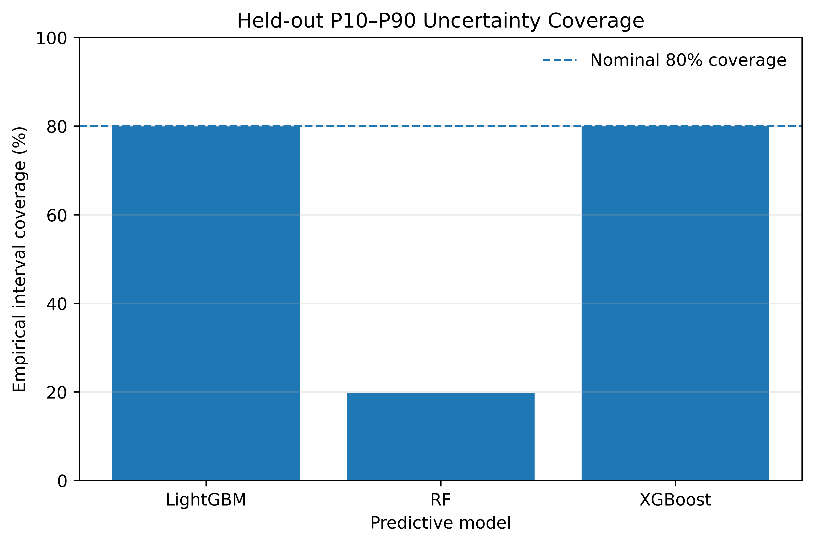
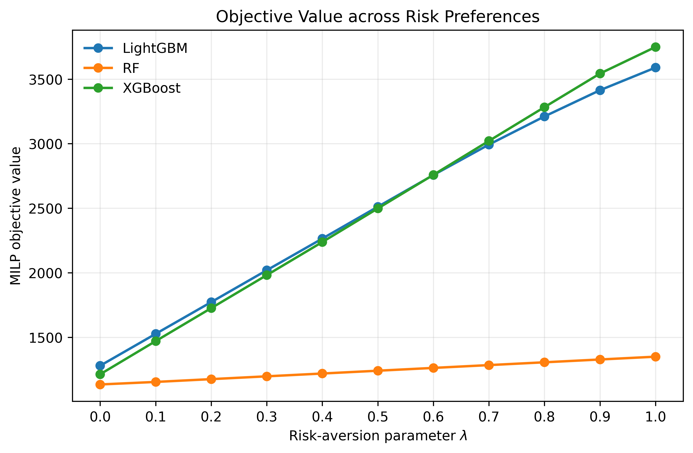
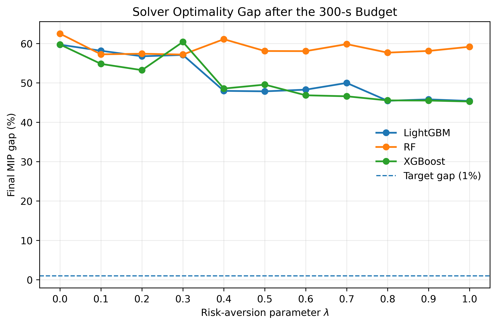
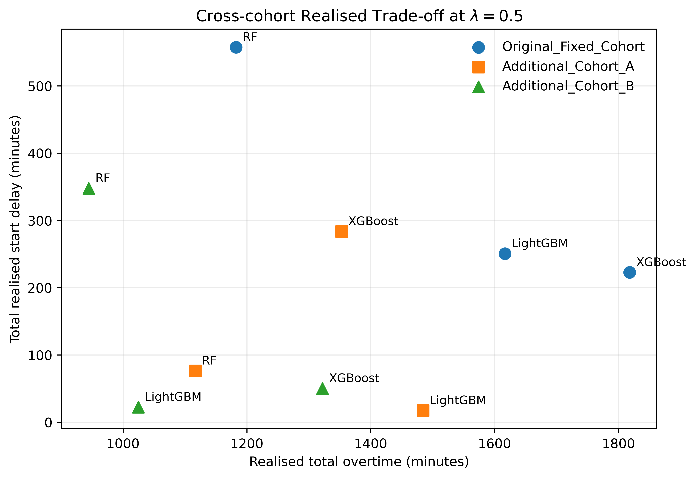

# Uncertainty-Aware Operating Room Scheduling

An uncertainty-aware **Predict-then-Optimize (PTO)** framework integrating probabilistic surgical-duration prediction with risk-aware mixed-integer linear programming (MILP) for operating room scheduling.

This repository contains the final validated implementation and experimental workflow developed for an MSc dissertation in Applied Artificial Intelligence at WMG, University of Warwick.

The project investigates not only **how accurately surgical duration can be predicted**, but also **how predictive uncertainty propagates into downstream scheduling decisions and realized operational outcomes**.

---

## Overview

Operating room (OR) scheduling is challenging because surgical durations are inherently uncertain. Underestimated durations can lead to downstream delays and overtime, while overly conservative planning may reduce effective capacity utilization.

This project develops an uncertainty-aware Predict-then-Optimize framework with four stages:

1. Predict patient-specific surgical-duration quantiles.
2. Convert predictive quantiles into risk-adjusted planning durations.
3. Generate room assignments and case sequences using a risk-aware MILP.
4. Replay the generated schedules using observed surgical durations to evaluate realized operational performance.

Three predictive pipelines are compared:

- **LightGBM**
- **Random Forest (RF)**
- **XGBoost**

The framework explicitly separates **predictive performance**, **planned optimization outcomes**, and **realized scheduling performance**.

---

## Framework

```text
Historical perioperative data
            │
            ▼
   Leakage-controlled
     preprocessing
            │
            ▼
 ┌─────────────────────┐
 │ Predictive Models   │
 │                     │
 │ • LightGBM          │
 │ • Random Forest     │
 │ • XGBoost           │
 └─────────────────────┘
            │
            ▼
       P10 / P50 / P90
            │
            ▼
   Risk-adjusted duration
          d_i(λ)
            │
            ▼
 ┌─────────────────────┐
 │ Risk-Aware MILP     │
 │                     │
 │ • Room assignment   │
 │ • Case sequencing   │
 │ • Start times       │
 │ • Overtime          │
 │ • Workload balance  │
 └─────────────────────┘
            │
            ▼
      Planned schedule
            │
            ▼
 Replace planning durations
 with observed durations
            │
            ▼
    Realized replay
            │
            ▼
 ┌─────────────────────┐
 │ Realized Outcomes   │
 │                     │
 │ • Overtime          │
 │ • Makespan          │
 │ • Start delay       │
 └─────────────────────┘
```

The risk-adjusted planning duration for surgical case \(i\) is

\[
d_i(\lambda)
=
(1-\lambda)P_{50,i}
+
\lambda P_{90,i},
\]

where \(P_{50,i}\) is the predicted median duration, \(P_{90,i}\) is the predicted upper quantile, and \(\lambda\in[0,1]\) controls risk aversion.

Higher values of \(\lambda\) place greater weight on upper-tail duration estimates.

---

## Data

The study uses retrospective perioperative data from the **Medical Informatics Operating Room Vitals and Events Repository (MOVER)**.

After preprocessing and duration validation:

| Stage | Records |
|---|---:|
| Initial records | 65,728 |
| After first-stage cleaning | 59,076 |
| Final valid-duration records | 59,066 |
| Training observations | 41,983 |
| Temporally held-out test observations | 17,083 |

A temporal train/test split was used:

- **Training period:** 12 November 2017 – 31 December 2021
- **Held-out evaluation period:** 1 January 2022 – 10 August 2023

The final predictor matrix contains **1,587 features**, comprising 1,572 procedure indicators and 15 non-procedure predictors.

Variables containing clear post-decision information, including postoperative outcomes and features derived from actual surgery start times, were excluded from the final predictive pipeline.

> **Data availability:** The underlying MOVER data are not redistributed through this repository. Users should obtain the source data independently and comply with the applicable data-access and usage conditions.

---

## Predictive Models

### LightGBM

LightGBM uses separate native quantile-regression models to estimate P10, P50, and P90 surgical durations.

### XGBoost

XGBoost similarly estimates P10, P50, and P90 using separate quantile-regression models.

### Random Forest

Random Forest is implemented as a conventional regression ensemble.

Unlike LightGBM and XGBoost, RF is **not treated as a native quantile-regression model**. P10, P50, and P90 are approximated from empirical percentiles of individual-tree predictions.

The resulting RF intervals therefore represent an **ensemble-dispersion approximation** to predictive uncertainty.

---

## Predictive Performance

Performance was evaluated on the temporally held-out test set containing 17,083 surgical cases.

| Model | P50 MAE (min) | P10 Lower Coverage | P90 Upper Coverage | P10–P90 Coverage |
|---|---:|---:|---:|---:|
| LightGBM | **74.76** | 90.19% | 89.74% | 79.93% |
| Random Forest | 93.90 | 60.58% | 59.14% | 19.72% |
| XGBoost | 85.13 | 90.27% | 89.83% | **80.09%** |

LightGBM achieved the lowest P50 MAE. LightGBM and XGBoost also produced substantially stronger empirical interval coverage than the RF ensemble-dispersion approximation.

However, predictive accuracy alone is not interpreted as evidence of superior downstream scheduling performance.



---

## Risk-Aware MILP

Predicted durations are passed into a mixed-integer linear programming model that determines:

- operating-room assignment;
- endogenous within-room case sequencing;
- planned start times;
- overtime-related quantities; and
- workload balancing.

### Main Configuration

| Parameter | Setting |
|---|---:|
| Cases per scheduling cohort | 12 |
| Operating rooms | 3 |
| Nominal capacity per room | 480 min |
| Turnover time | 20 min |
| Workload-balance weight \(\beta\) | 0.10 |
| Risk-aversion parameter \(\lambda\) | 0.0–1.0 |
| Main planning-duration cap | 360 min |
| Solver time budget | 300 s |
| Target relative MIP gap | 1% |

The main risk frontier evaluates

\[
\lambda \in \{0,0.1,0.2,\ldots,1.0\}
\]

for each of the three predictive pipelines, producing **33 main MILP instances**.



---

## Solver Performance

All **33/33** main MILP instances returned feasible incumbent schedules within the 300-second computational budget.

However:

- 33/33 instances reached the time limit;
- 0/33 reached the prespecified 1% MIP-gap target;
- median final MIP gap was **56.76%**;
- mean final MIP gap was **53.48%**.

The reported schedules should therefore be interpreted as **time-limited feasible incumbent schedules**, not as globally optimal schedules.

The MIP gap represents the relative separation between the best feasible incumbent and the solver's bound on the globally optimal objective value. It should not be interpreted directly as operational performance loss.



---

## Realized-Duration Evaluation

Planned objective values are not used by themselves to establish cross-model operational superiority because each predictive model supplies different duration inputs to its own optimization problem.

Instead, the project uses a common **realized-duration replay**:

```text
Predicted durations
        │
        ▼
Generate MILP schedule
        │
        ▼
Freeze room assignment
and within-room ordering
        │
        ▼
Substitute observed
ACTUAL_DURATION
        │
        ▼
Propagate downstream
start times
        │
        ▼
Measure realized outcomes
```

No hindsight re-optimization is performed after observed durations are introduced.

The final evaluation includes:

- the primary 12-case cohort at \(\lambda=0\), \(0.5\), and \(1.0\);
- additional Cohort A at \(\lambda=0.5\);
- additional Cohort B at \(\lambda=0.5\).

Across three predictive pipelines, this gives **15 realized schedule evaluations**.

The three cohorts are mutually non-overlapping.

---

## Key Findings

### 1. Predictive accuracy did not guarantee scheduling dominance

LightGBM achieved the strongest P50 point-prediction performance, but it did not consistently dominate the realized operational metrics.

This illustrates an empirical **prediction–optimization gap**: improvements in predictive accuracy do not necessarily translate directly into superior downstream decisions.

### 2. Uncertainty representation materially affected risk sensitivity

LightGBM and XGBoost achieved approximately 80% empirical P10–P90 interval coverage, whereas the RF approximation achieved only 19.72%.

The comparatively weak separation between RF's P50 and P90 scheduling inputs was associated with a flatter response to increasing risk aversion.

### 3. Risk aversion introduced an overtime–delay trade-off

On the primary cohort, increasing \(\lambda\) reduced propagated start delay across all three predictive pipelines.

For LightGBM and XGBoost, however, greater protection against upper-tail duration uncertainty was accompanied by higher realized overtime.

Increasing risk aversion therefore did not produce uniformly better operational outcomes.

### 4. Cross-model planned objectives were not directly comparable

Because each predictive model supplies different planning durations, lower model-specific MILP objective values were not interpreted as direct evidence of operational superiority.

Observed-duration replay provides a common basis for comparing downstream outcomes.

### 5. No model dominated all realized outcomes

At \(\lambda=0.5\), Random Forest produced the lowest realized overtime across all three evaluated cohorts, but it did not consistently minimize propagated start delay.

The results therefore do not identify a universally superior predictive model or risk setting.



---

## Duration-Cap Sensitivity

The main experiments apply a 360-minute upper cap to planning durations.

At \(\lambda=0.5\), no case in the primary cohort was capped for any of the three models, meaning that the cap did not directly affect the central cross-model comparison.

At \(\lambda=1\):

| Model | Cases Capped |
|---|---:|
| LightGBM | 4/12 |
| Random Forest | 0/12 |
| XGBoost | 9/12 |

An uncapped sensitivity analysis was therefore performed at \(\lambda=1\).

Relative to the capped runs, objective values among the returned feasible incumbents changed by approximately:

- **LightGBM:** +4.28%
- **Random Forest:** 0%
- **XGBoost:** +1.57%

Because these runs were time-limited, these values represent sensitivity among returned feasible incumbents rather than differences between proven globally optimal solutions.

---

## Repository Structure

```text
.
├── preprocessing/
│   ├── pre-processing.py
│   └── feature_engineering.py
│
├── models/
│   ├── lightgbm.ipynb
│   ├── random_forest.ipynb
│   └── xgboost.ipynb
│
├── uncertainty/
│   ├── lightgbm_quantile_uncertainty.py
│   ├── rf_quantile_uncertainty.py
│   └── xgb_quantile_uncertainty.py
│
├── optimization/
│   ├── milp_engine.ipynb
│   ├── optimizer_input_verification.ipynb
│   └── sequencing_verification.ipynb
│
├── evaluation/
│   ├── experiment_runner.ipynb
│   ├── realised_schedule_validation.ipynb
│   ├── realised_model_comparison.ipynb
│   ├── additional_cohort_validation.ipynb
│   ├── duration_cap_audit.ipynb
│   ├── duration_cap_sensitivity.ipynb
│   └── room_metric_semantics_audit.ipynb
│
├── results/
│   ├── optimization/
│   ├── realized/
│   ├── sensitivity/
│   └── audits/
│
├── figures/
│   └── final/
│
├── requirements.txt
├── LICENSE
├── .gitignore
└── README.md
```

### Core Components

- **`preprocessing/`** — data cleaning and leakage-controlled feature engineering.
- **`models/`** — final LightGBM, Random Forest, and XGBoost predictive pipelines.
- **`uncertainty/`** — generation of model-specific P10/P50/P90 scheduling inputs.
- **`optimization/`** — final risk-aware MILP implementation and formulation verification.
- **`evaluation/`** — realized-duration replay, cross-cohort validation, solver diagnostics, and sensitivity analyses.
- **`results/`** — aggregate outputs retained for the final analysis.
- **`figures/final/`** — figures generated from the final validated experimental pipeline.

Legacy experiments that do not form part of the final methodology are intentionally excluded from the public repository.

---

## Reproduction Workflow

The final experimental pipeline follows the sequence below:

1. Run the preprocessing and feature-engineering scripts in `preprocessing/`.
2. Train the LightGBM, Random Forest, and XGBoost pipelines in `models/`.
3. Generate P10/P50/P90 predictions using the scripts in `uncertainty/`.
4. Verify model-specific optimizer inputs using `optimization/optimizer_input_verification.ipynb`.
5. Verify the final sequencing formulation using `optimization/sequencing_verification.ipynb`.
6. Run the final MILP implementation in `optimization/milp_engine.ipynb`.
7. Execute the risk-frontier experiments using `evaluation/experiment_runner.ipynb`.
8. Evaluate generated schedules against observed durations using the realized-replay notebooks in `evaluation/`.
9. Run cross-cohort and duration-cap sensitivity analyses.
10. Generate the final aggregate results and figures.

### Installation

Clone the repository:

```bash
git clone https://github.com/<your-username>/uncertainty-aware-or-scheduling.git
cd uncertainty-aware-or-scheduling
```

Create a virtual environment if desired and install the required packages:

```bash
pip install -r requirements.txt
```

The underlying MOVER data must be obtained separately and placed in the appropriate local data directory before running the preprocessing pipeline.

---

## Reproducibility Notes

- Random seed: **42**
- Predictive train/test separation is temporal rather than random.
- Procedure one-hot encoding is fitted using training data only.
- The same leakage-controlled feature representation is used across the three predictive pipelines.
- Realized replay does not perform hindsight re-optimization.
- Additional cohorts are sampled without replacement using the fixed random seed.
- Main MILP runs use a 300-second computational budget.

Exact package versions should be installed from `requirements.txt`.

---

## Limitations

The results should be interpreted within several limitations:

- the analysis is retrospective and based on a single data environment;
- realized evaluation uses a limited number of 12-case cohorts;
- the MILP simplifies real-world operating-room constraints;
- some historical clinical indicators have source-timestamp limitations;
- RF uncertainty represents between-tree ensemble dispersion rather than native conditional quantile regression;
- the 360-minute duration cap affects some upper-tail predictions;
- all main MILP instances reached the 300-second solver limit; and
- global optimality was not established.

The repository should therefore be interpreted as an academic demonstration of uncertainty-aware Predict-then-Optimize scheduling rather than a deployment-ready clinical decision-support system.

---

## Ethics and Data Availability

This project uses secondary retrospective data.

The associated dissertation received confirmation from WMG that ethical approval was waived for the research.

The underlying MOVER dataset and patient/case-level derived data are **not redistributed through this repository**.

No identifiable patient information should be committed to the repository.

---

## Citation

If you use or build upon this work, please cite the associated dissertation:

```bibtex
@mastersthesis{zhu2026uncertainty,
  author = {Peter Zhu},
  title = {Uncertainty-Aware Predict-then-Optimize for Operating Room Scheduling},
  year = {2026}
}
```

---

## License

The source code in this repository is distributed under the license specified in `LICENSE`.

The repository license applies only to the code and original repository materials. It does **not** grant rights to redistribute the underlying MOVER dataset.

---

## Disclaimer

This repository was developed for academic research.

The predictive and scheduling framework is **not intended for direct clinical use**. Prospective validation, institution-specific adaptation, and appropriate clinical, operational, ethical, and governance review would be required before any real-world deployment.
